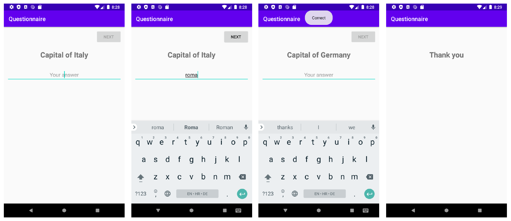

# Laboratorijska vježba 3 - Trivia Quiz Template

## Zadatak

Implementirajte aplikaciju kao što je prikazano na slikama. Korisnik ne može prijeći na sljedeće pitanje ako nije odgovoreno. Istražite i implementirajte životni ciklus aplikacije. Odgovorite što se događa s aplikacijom kada se klikne na Back, Home i App overview gumbe, a potom i prilikom promjene orijentacije. Shodno shvaćanju, osigurajte očuvanje trenutnog pitanja iz repozitorija, prilikom promjene orijentacije.
Nije potrebno spremati pitanja i rezultate u bazu podataka, već je dovoljno samo spremiti u listu ili polje kako bi podaci bili dostupni za vrijeme rada aplikacije.

**Osim dogovorenog toka interakcije, sama aplikacija mora biti zadovoljiti iduće stavke:**

- Svi resursi u aplikaciji moraju biti pravilno definirani (slike različitih rezolucija, padding, margin, color, text...). Koristite stilove.
- Mora pratiti dostavljeni dizajn.
- Mora biti postavljena ikona aplikacije prilagođena svim mogućim varijacijama ikona koje su moguće u Android okruženju.
- Aplikacija mora biti responzivna.

## **Dizajn**

Izvor: Visoko učilište Algebra - Izrada aplikacija za mobilne uređaje

## Tehnička dokumentacija

[Intent | Android Developers](https://developer.android.com/reference/android/content/Intent)
