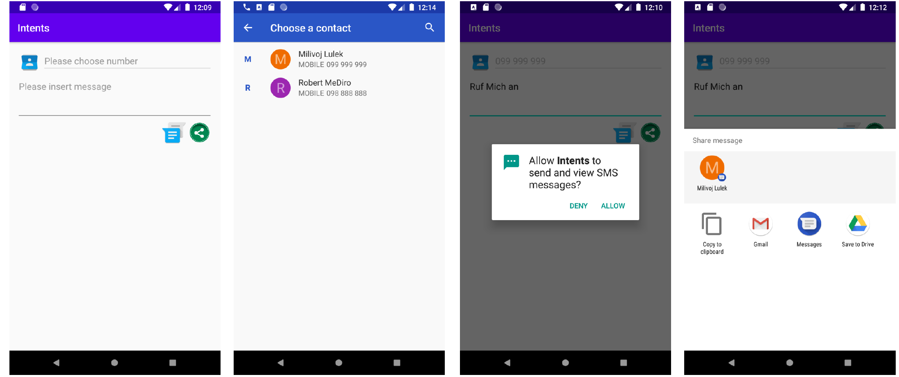

# Laboratorijska vježba 4 - Semly

## Zadatak

Implementirajte aplikaciju kao što je prikazano na slikama.

Gumb za sms mora biti onemogućen ako broj kontakta nije odabran te ako poruka nije unesena, dok je share gumb onemogućen ako poruka nije unesena. 

Gumb contacts šalje Intent odabira kontakata te u povratku sa Contacts aplikacije upisuje broj kontakta Gumb sms omogućuje izravno slanja sms poruke.

Da bi sms mogao biti izravno poslan Intentom, moraju se osigurati dopuštenja od korisnika.

Gumb share šalje Intent odabira različitih načina podjeljivanja sadržaja poruke.

**Osim dogovorenog toka interakcije, sama aplikacija mora biti zadovoljiti iduće stavke:**

- Svi resursi u aplikaciji moraju biti pravilno definirani (slike različitih rezolucija, padding, margin, color, text...). Koristite stilove.
- Mora pratiti dostavljenu arhitekturu, dizajn po želji.
- Mora biti postavljena ikona aplikacije prilagođena svim mogućim varijacijama ikona koje su moguće u Android okruženju.
- Aplikacija mora biti responzivna.

## Dizajn

## Cilj

Naučiti i razumjeti komunikacija među aplikacijama.

## Dokumentacija

[Intent | Android Developers](https://developer.android.com/reference/android/content/Intent)